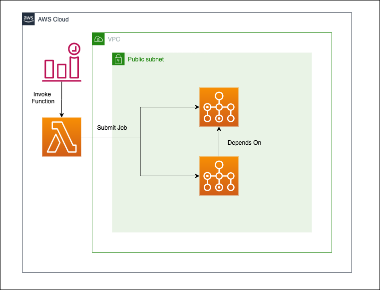

# Sequential AWS Batch Job


## What's this?

This repository shows **how to write sequential AWS Batch Job in Terraform**.



## What's the purpose?

To make little bit complicated job workload with AWS Resources.

For instance, image processsing. We're facing lots of batch processing to prepare for making ML engine or analyze image patterns. Thanks to these pre-processing, ML engineers or data scientists are concentrated on their professional works.

However, managing batch processing is not easy. These operations largely depends on the amount of data in a shot and other services like web applications and external API services. Sometimes, we have to allocate large server to execute batch job, sometimes these services may change their interface suddenly.

Moreover, each batch jobs are not always completely independent. Some jobs must wait other operation ends. We have to manage and deal with these problems in the same time. Isn't it troublesome?

Of course, If you're in a large mature team, your team can assign memeber to develop only this system. Nowadays, great useful workflow engines or orchestration service have developed like Airflow, Luigi etc.. These service provide good interface and useful schedulers and recovery system.However, small team doesn't. If possible, we would like to use managed service. If we're using AWS, AWS Batch is good option.

## What does the repository contain or not?

**Contains**

- AWS Batch creation in Terraform
- Lambda-based batch job control
- Terraform Cloud CI/CD
  - This repository isn't assumed to be executed on local

**Not Contains**

- Custom image execution
  - Just adding ECR resources and rewrite job definition
- StepFunction implementation
- **Sequential and parallel** batch job workflow
  - AWS Batch can easily parallelize jobs
- Cost optimization with SPOT instance

## How do I try this out?

This repository demands **IAM user secrets** to communicate with AWS. This user must be able to handle AWS resources. It may be appropriate to assign PowerUserAccess + IAMFullAccess or AdministratorAccess.

These credentials are used on two situations.

- Local planning
- Remote Planning & Applying

So, It's better to **create IAM user before stepping into the below**. You can avoid unexpected error, I guess.

```bash
$ git clone https://github.com/hayata-yamamoto/sequential-aws-batch-job.git

# tfenv if multiple terraform versions used
# https://github.com/tfutils/tfenv
$ brew install tfenv
$ tfenv install 0.12.29
$ tfenv use 0.12.29

# direnv if needed
# https://github.com/direnv/direnv
$ brew install direnv
$ eval "$(direnv hook zsh)" # for zsh
$ touch .envrc
$ echo "export AWS_ACCESS_KEY_ID=hoge" >> .envrc
$ echo "export AWS_SECRET_ACCESS_KEY=hoge" >> .envrc
$ echo "export AWS_REGION=ap-northeast-1" >> .envrc
$ echo "export AWS_DEFAUTL_REGION=ap-northeast-1" >> .envrc
$ direnv allow .

$ cd aws/ap-northeast-1
$ terraform init
$ terraform plan
```

## Technical Information

**Python**

> Available: ^3.6

**Terraform**

```bash
❯❯❯ terraform version
Terraform v0.12.29
+ provider.aws v3.1.0
```

**AWS**

- AWS Batch
- CloudWatch Event
- Lambda
- VPC

**CI/CD**

GitHub Actions

- To check Python codes

Terraform Cloud

- To plan and apply terraform
- Slack notification
- tfstate management
